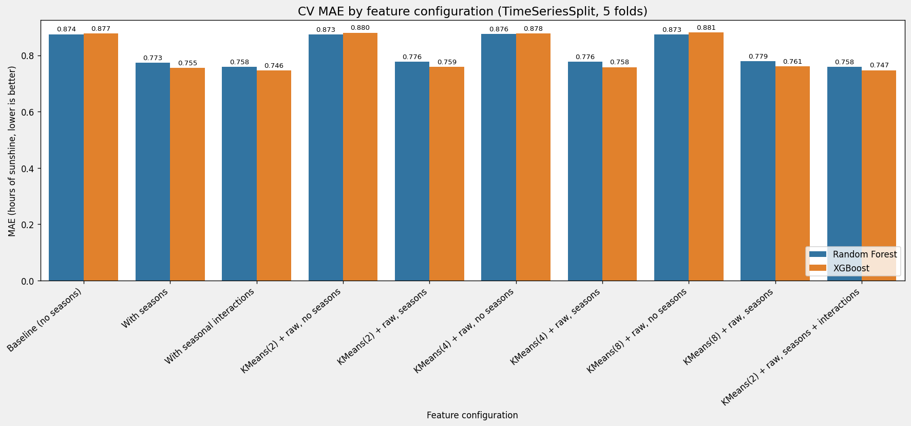
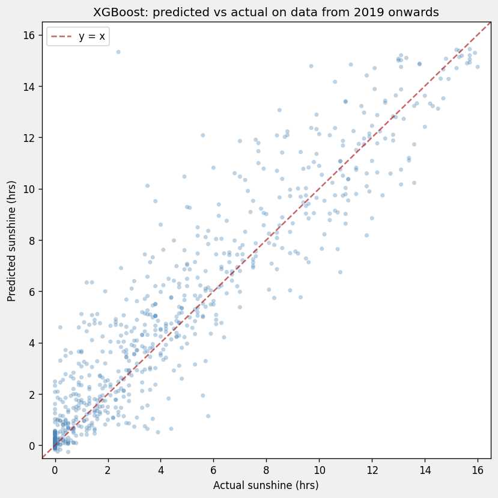

# Predicting daily sunshine at London Heathrow

Important to stress that this is **not** a forecasting project. 

Using the dataset of daily weather at London Heathrow from the ECA&D, a set of variables (cloud cover, global radiation, pressure, etc..) were subjected to wrangling and feature engineering techniques with the aim of using machine learning models to predict that day's hours of sunshine.

Random Forest and XGBoost regressors were compared on the multiple different feature configurations produced, then scored using cross validation with a temporal data consious split.



The best model was then taken further and evaluated on how it would perform in production, training it on pre 2019 data and scoring it on the final two years of the dataset, 2019 and 2020 data. The gradient boosting model was able to predict the same day sunshine with 1.147 ± 0.046 hrs (68.8 ± 2.7 minutes). This showed a hold out gap of 0.401 hrs (24.0 minutes)



This was an exercise on the correct handling practices of large complex data, data analysis, feature engineering, cross validation of a time series, and evaluation of output. The main point of the project was the methodology. Whilst the model does work, the output of 1.15 Hrs MAE is unremarkable in itself and given the low practicallity of the project (same-day sunshine is rarely a value that needs predicting), an honest conclusion of this work is that the model is not worth deploying.

## Data

`data/ECA_london_weather_heathrow.csv`: Raw csv of 15,341 daily records dated from 1979-01-01 to
2020-12-31, sourced from the European Climate Assessment & Dataset referenced below.

Permission to use the data is granted provided the following is acknowledged:
> Klein Tank, A.M.G. and Coauthors, 2002. Daily dataset of 20th-century surface
> air temperature and precipitation series for the European Climate Assessment.
> Int. J. of Climatol., 22, 1441-1453. Data and metadata available at
> http://www.ecad.eu

## Layout

```
data/            ECA&D CSV
src/             modules
notebooks/       EDA and Modelling notebooks
    figures/     output figures
requirements.txt pinned dependencies
```

## Setup

```bash
python3 -m venv .venv
source .venv/bin/activate    # windows: .venv\Scripts\activate
pip install -r requirements.txt
```
Run notebooks/01_eda.ipynb and notebooks/02_modelling.ipynb (must be from the notebooks directory)

